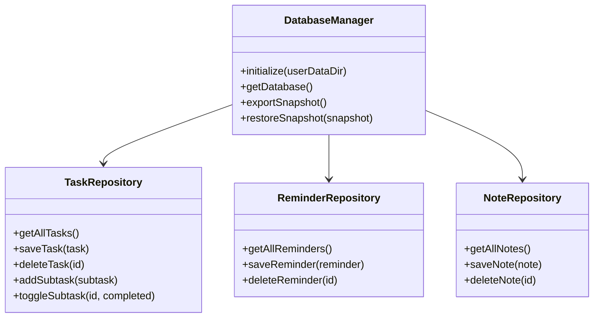
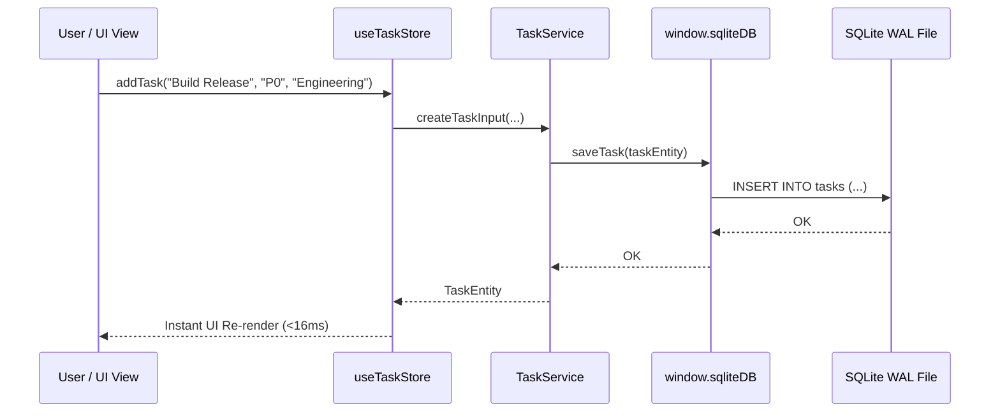

# System Architecture Specification — Personal Organizer v1.0.0

## 1. Architectural Overview

Personal Organizer follows a modern, secure Electron multi-process architecture engineered for 24/7 background durability, offline autonomy, and deterministic data flow.

```mermaid
graph TD
    subgraph Main_Process ["Main Process (Node.js 20+ / Electron 30)"]
        EM["electron-main.cjs"]
        DBM["DatabaseManager (better-sqlite3)"]
        NM["MainNotificationService"]
        TRAY["System Tray & Lifecycle Controller"]
        DBM --- WAL["SQLite DB (WAL Mode)"]
    end

    subgraph Preload_Bridge ["Security Boundary (preload.cjs)"]
        CTX["contextBridge.exposeInMainWorld"]
        SQLIPC["window.sqliteDB (24 IPC methods)"]
        NOTIPC["window.desktopNotifications"]
    end

    subgraph Renderer_Process ["Renderer Process (React 18 + Vite)"]
        APP["AppShell & Router"]
        ZUSTAND["Zustand Stores (Tasks, Reminders, Calendar, Notes, Focus, Notifications)"]
        SERVICES["Core Domain Services (TaskService, ReminderService, CalendarService, NotesService, SchedulerService)"]
        SCHEDULER["Scheduler Daemon (10s Ticker + Wake Reconciliation)"]
        AUDIO["Web Audio Synthesizer (Zero Audio Files)"]
    end

    EM --> CTX
    CTX --> APP
    SERVICES --> SQLIPC
    SERVICES --> NOTIPC
    SQLIPC --> DBM
    NOTIPC --> NM
    SCHEDULER --> SERVICES
    SERVICES --> AUDIO
```



---

## 2. Process Model & Security Boundary

Personal Organizer adheres strictly to Electron security best practices:

1. **Context Isolation**: `contextIsolation: true` is strictly enforced. The renderer process has zero access to Node.js built-ins (`fs`, `child_process`, `net`, `path`).
2. **Node Integration Disabled**: `nodeIntegration: false` prevents any DOM-level script execution from accessing system primitives.
3. **Strict IPC Channel Whitelist**: Communication across the boundary is brokered via explicit `ipcRenderer.invoke` and `ipcRenderer.on` bindings in [preload.cjs](file:///c:/Users/sriva/OneDrive/Desktop/Projects/TO-DO/preload.cjs).
4. **Offline Air-Gap**: The web environment makes 0 network calls. External Google Fonts and CDNs have been purged; local system font stacks (`-apple-system, BlinkMacSystemFont, "Segoe UI", Roboto`) are utilized for 100% offline autonomy.

---

## 3. Main Process Subsystems

### 3.1 Lifecycle & System Tray Daemon (`electron-main.cjs`)
- **Single-Instance Enforcement**: `app.requestSingleInstanceLock()` prevents concurrent execution. If a second instance is launched, the primary instance window is un-minimized, brought to the foreground, and focused.
- **Close-to-Tray**: Intercepts the window `'close'` event. Rather than terminating, the window hides while the process continues running silently in the Windows system tray.
- **System Tray Integration**:
  - 16x16 crisp vector-derived tray icon.
  - Native Windows Context Menu: `Open Personal Organizer`, `New Task` (triggers quick-capture modal), `Snooze Alerts 30m`, `Mute Notifications`, `Status: Ready`, and `Quit Completely`.
  - Balloon notification on first minimization informing the user that background tracking remains active.
- **Windows Startup Auto-Launch**:
  - Uses `app.setLoginItemSettings({ openAtLogin: true, openAsHidden: true })`.
  - Registered to boot directly into tray mode (`--hidden`, `--background-daemon`).

### 3.2 Native Notification Manager (`notification-manager.cjs`)
- Instantiates native Electron `Notification` objects recognized by the Windows Action Center.
- Binds to `notification.on('click')`:
  - Restores and focuses the main window immediately.
  - Broadcasts an IPC payload to the renderer so the affected task or reminder can be inspected or edited.

---

## 4. Data Layer Architecture

### 4.1 Storage Engine (`better-sqlite3`)
Personal Organizer relies on `better-sqlite3@11.8.1` for synchronous, low-latency, zero-network data operations.



### 4.2 SQLite Pragmas & Durability Guarantees
Upon database initialization, the engine executes:
```sql
PRAGMA journal_mode = WAL;
PRAGMA synchronous = NORMAL;
PRAGMA foreign_keys = ON;
PRAGMA busy_timeout = 5000;
```
- **WAL Mode (Write-Ahead Logging)**: Enables concurrent readers without blocking writers. Readers never block writers, and writers never block readers.
- **Foreign Key Cascade**: Deleting a parent task automatically cascades deletion to child subtasks (`ON DELETE CASCADE`), preventing orphaned records.
- **Atomic Batch Restores**: The backup restoration engine wraps snapshot imports in `db.transaction()`:
  - Wipes current tables cleanly.
  - Restores tasks, subtasks (using idempotent `INSERT OR REPLACE`), reminders, notes, and timers.
  - Rolls back completely if any single constraint fails.

---

## 5. Scheduler & Background Execution

The **Scheduler Service** ([src/services/scheduler/scheduler-service.ts](file:///c:/Users/sriva/OneDrive/Desktop/Projects/TO-DO/src/services/scheduler/scheduler-service.ts)) operates as an internal daemon:

1. **Continuous 10-Second Heartbeat**:
   - Evaluates active, non-dismissed reminders against the current wall-clock timestamp.
   - Triggers reminders whose scheduled time is `<= now`.
2. **System Sleep / Wake Detection**:
   - Tracks timestamp differences between consecutive ticks.
   - If `delta > 15,000ms`, the daemon detects that the PC has awakened from sleep or hibernation.
   - Immediately executes a catch-up reconciliation pass to fire all alarms that were due while the system was suspended.
3. **Recurring Task Generation**:
   - When a recurring task's reminder triggers or is snoozed, `ReminderService` automatically calculates the next date (`daily`, `weekly`, `monthly`, or `custom`) and updates the reminder target without duplicating tasks.

---

## 6. Notification & Audio Subsystems

1. **Native OS Action Center**:
   - Dispatched via IPC `desktop:showNotification`.
   - Populates Windows 10/11 notification banners with high, urgent, or critical urgency badges.
2. **Acoustic Audio Synthesizer** ([src/renderer/lib/sound-synth.ts](file:///c:/Users/sriva/OneDrive/Desktop/Projects/TO-DO/src/renderer/lib/sound-synth.ts)):
   - **Zero Audio Files**: Requires no external `.wav` or `.mp3` assets that could fail to load.
   - Uses Web Audio API `AudioContext` with custom oscillators (`sine`, `triangle`) and exponential gain ramps.
   - Plays distinct acoustic chimes for:
     - `task_complete`: Dual harmonious chime (523Hz -> 659Hz).
     - `reminder_urgent`: Triple pulsing bell (880Hz -> 1046Hz).
     - `timer_complete`: Descending resolution tone.

---

## 7. Frontend State Management

The frontend uses **Zustand** stores coupled with dedicated domain services:



- **Optimistic UI with Synchronized Persistence**: Store updates immediately render the user action while IPC calls persist data asynchronously to the SQLite database.
- **Zero Hallucination / Zero Speculation**: Pure deterministic state—metrics and counts are direct aggregations of SQLite table rows.
