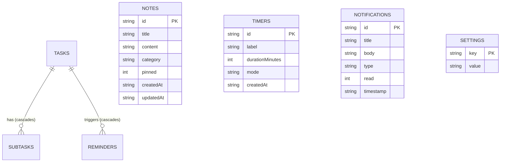

# Database Architecture & Schema Specification — Personal Organizer v1.0.0

## 1. Overview & Engine Specification

Personal Organizer uses an embedded, local-first database engine built on **SQLite 3** via the **`better-sqlite3`** C++ native driver. 

### Core Database Attributes
- **Engine**: SQLite 3 (better-sqlite3 v11.8.1)
- **Primary Storage Path**: `%APPDATA%\personal-organizer\personal_organizer.db` (or application root directory)
- **Journal Mode**: **WAL (Write-Ahead Logging)**
- **Synchronization**: `NORMAL` (safe against application crashes, optimal write performance)
- **Foreign Keys**: `ON` (enforces strict referential integrity and cascading deletes)
- **Busy Timeout**: `5000ms` (handles concurrent query bursts gracefully)



---

## 2. Table Schemas (DDL)

### 2.1 Tasks Table (`tasks`)
Stores all actionable task entities, priority classifications, schedule parameters, and recurring generation rules.

```sql
CREATE TABLE IF NOT EXISTS tasks (
    id TEXT PRIMARY KEY,
    title TEXT NOT NULL,
    description TEXT,
    priority TEXT NOT NULL DEFAULT 'P2',
    status TEXT NOT NULL DEFAULT 'todo',
    dueDate TEXT,
    dueTime TEXT,
    recurring TEXT DEFAULT 'none',
    createdAt TEXT NOT NULL,
    updatedAt TEXT NOT NULL
);
```

#### Fields & Constraints:
- `id` (TEXT, PK): Unique identifier formatted as `task_<timestamp>_<rand>` or `task-<id>`.
- `title` (TEXT, NOT NULL): The task name or headline.
- `description` (TEXT): Detailed notes. Also embeds task categories using metadata comment syntax: `<!--category:Engineering-->`.
- `priority` (TEXT, NOT NULL): Strict enum constraint: `'P0'` (Critical), `'P1'` (High), `'P2'` (Normal), `'P3'` (Low).
- `status` (TEXT, NOT NULL): Strict status constraint: `'todo'`, `'in_progress'`, or `'completed'`.
- `dueDate` (TEXT): Date in ISO format `YYYY-MM-DD`.
- `dueTime` (TEXT): 24-hour time in `HH:MM` format.
- `recurring` (TEXT): Recurrence frequency: `'none'`, `'daily'`, `'weekly'`, `'monthly'`, or `'custom'`.
- `createdAt` / `updatedAt` (TEXT, NOT NULL): ISO 8601 UTC timestamps.

---

### 2.2 Subtasks Table (`subtasks`)
Hierarchical checklist items attached to parent tasks. Deleting a parent task automatically deletes its child subtasks.

```sql
CREATE TABLE IF NOT EXISTS subtasks (
    id TEXT PRIMARY KEY,
    taskId TEXT NOT NULL,
    title TEXT NOT NULL,
    completed INTEGER NOT NULL DEFAULT 0,
    createdAt TEXT NOT NULL,
    FOREIGN KEY (taskId) REFERENCES tasks(id) ON DELETE CASCADE
);
```

#### Fields & Constraints:
- `id` (TEXT, PK): Subtask identifier (`subtask_<timestamp>_<rand>`).
- `taskId` (TEXT, NOT NULL, FK): Points to `tasks(id)`. Cascades on deletion (`ON DELETE CASCADE`).
- `completed` (INTEGER, NOT NULL): Boolean flag (`0` for incomplete, `1` for completed).

---

### 2.3 Reminders Table (`reminders`)
Stores scheduled alarm events monitored by the 24/7 background scheduler daemon.

```sql
CREATE TABLE IF NOT EXISTS reminders (
    id TEXT PRIMARY KEY,
    taskId TEXT,
    title TEXT NOT NULL,
    scheduledTime TEXT NOT NULL,
    urgency TEXT NOT NULL DEFAULT 'normal',
    recurring TEXT DEFAULT 'none',
    status TEXT NOT NULL DEFAULT 'pending',
    createdAt TEXT NOT NULL,
    FOREIGN KEY (taskId) REFERENCES tasks(id) ON DELETE CASCADE
);
```

#### Fields & Constraints:
- `id` (TEXT, PK): Reminder identifier (`rem_<timestamp>_<rand>`).
- `taskId` (TEXT, NULLABLE, FK): Optional parent task reference. Cascades on task deletion.
- `scheduledTime` (TEXT, NOT NULL): ISO 8601 timestamp (`YYYY-MM-DDTHH:mm:ss.sssZ`).
- `urgency` (TEXT, NOT NULL): Urgency tier: `'normal'`, `'urgent'`, or `'critical'`.
- `status` (TEXT, NOT NULL): State enum: `'pending'`, `'triggered'`, `'snoozed'`, or `'dismissed'`.

---

### 2.4 Notes Table (`notes`)
Stores rich markdown documents and notes repository entries.

```sql
CREATE TABLE IF NOT EXISTS notes (
    id TEXT PRIMARY KEY,
    title TEXT NOT NULL,
    content TEXT,
    category TEXT DEFAULT 'Personal',
    pinned INTEGER NOT NULL DEFAULT 0,
    createdAt TEXT NOT NULL,
    updatedAt TEXT NOT NULL
);
```

#### Fields & Constraints:
- `category` (TEXT): Classification: `'Engineering'`, `'Architecture'`, `'Product'`, `'Design'`, `'Personal'`.
- `pinned` (INTEGER, NOT NULL): Boolean flag (`1` displays note in top pinned drawer).

---

### 2.5 Timers Table (`timers`)
Stores focus session presets and elapsed session metrics.

```sql
CREATE TABLE IF NOT EXISTS timers (
    id TEXT PRIMARY KEY,
    label TEXT NOT NULL,
    durationMinutes INTEGER NOT NULL,
    mode TEXT NOT NULL DEFAULT 'pomodoro',
    createdAt TEXT NOT NULL
);
```

---

### 2.6 Notifications Table (`notifications`)
Stores the historical audit log of all dispatched system notifications.

```sql
CREATE TABLE IF NOT EXISTS notifications (
    id TEXT PRIMARY KEY,
    title TEXT NOT NULL,
    body TEXT,
    type TEXT NOT NULL DEFAULT 'reminder',
    read INTEGER NOT NULL DEFAULT 0,
    timestamp TEXT NOT NULL
);
```

---

### 2.7 Settings Key-Value Table (`settings`)
Stores application preferences, theme selections, and launch settings.

```sql
CREATE TABLE IF NOT EXISTS settings (
    key TEXT PRIMARY KEY,
    value TEXT NOT NULL
);
```

---

## 3. Database Performance Indexes

The schema includes targeted B-Tree indexes optimizing hot query paths:

```sql
CREATE INDEX IF NOT EXISTS idx_tasks_dueDate ON tasks(dueDate);
CREATE INDEX IF NOT EXISTS idx_tasks_priority ON tasks(priority);
CREATE INDEX IF NOT EXISTS idx_tasks_status ON tasks(status);
CREATE INDEX IF NOT EXISTS idx_subtasks_taskId ON subtasks(taskId);
CREATE INDEX IF NOT EXISTS idx_reminders_scheduledTime ON reminders(scheduledTime);
CREATE INDEX IF NOT EXISTS idx_reminders_status ON reminders(status);
CREATE INDEX IF NOT EXISTS idx_notes_pinned ON notes(pinned);
CREATE INDEX IF NOT EXISTS idx_notifications_read ON notifications(read);
```

---

## 4. WAL Mode & Concurrency Model

### 4.1 Write-Ahead Log Operation
In WAL mode, changes are written to a companion log file (`personal_organizer.db-wal`) rather than directly overwriting the main database. 
- Readers access data concurrently with zero lock contention.
- Writes are committed sequentially to the WAL log with immediate durability.
- Periodically or upon clean shutdown, SQLite checkpoints the WAL log back into the main `.db` file.

### 4.2 Crash Recovery
If the host operating system reboots or power is interrupted:
- On next application startup, SQLite detects the existing WAL file.
- It automatically replays committed transactions from the WAL log.
- Uncommitted or incomplete transactions are safely discarded without database corruption.
